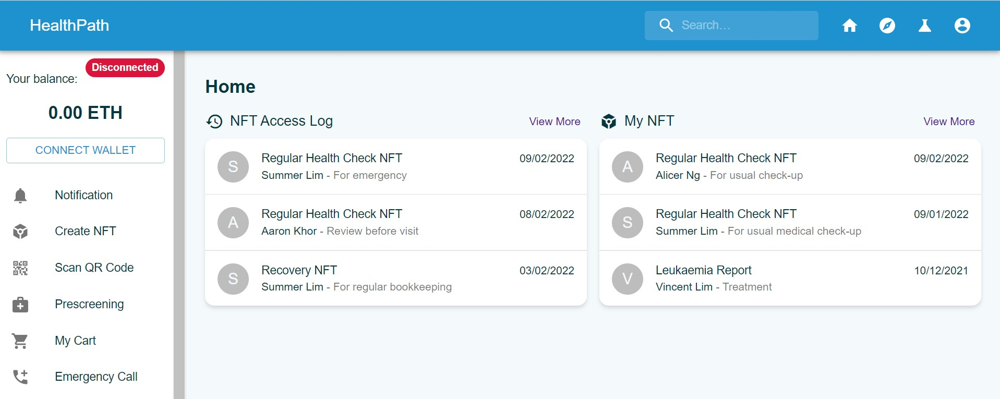

## About

HealthPath utilizes NFT and IPFS technologies to ensure a complete, secured and fully transparent medical journey for you.

Submission for [NUS FinTech Hackathon 2022](https://nusfintechmonth.comp.nus.edu.sg/)

### [Link to prototype](https://health-path.vercel.app/)



## Challenge

Non-fungible tokens (NFTs) is one of the most exciting innovations in the blockchain scene. Are you able to further break the boundaries of the world of NFTs?

## Our solution

By utilizing NFT and IPFS technologies, the medical journey could be complete, secured and fully transparent with Immutable Health Records and Drug Supply Chain Records.

## Features

- Able to connect wallet and make payment, create token with MetaMask

| Page              | Feature                                            |
| ----------------- | -------------------------------------------------- |
| Home Page         | 1. View NFT access log, user's NFTs                |
|                   | 2. Click user's NFT to view details                |
| Explore Page      | 1. View clinics nearby and pharmaceutical products |
|                   | 2. Add products to cart                            |
| Research Page     | 1. View research available for users to contribute |
| Notification Page | 1. View notifications of approved application      |
| Profile Page      | 1. View user information                           |
| Create NFT Page   | 1. Fill up create NFT form                         |
|                   | 2. Create a token via smart contract               |
| My Cart Page      | 1. View products in cart                           |

## Tools

- React
- Solidity for smart contract

## To run the app locally

```
npm install
```

Then

```
npm start
```

to start the server and develop
